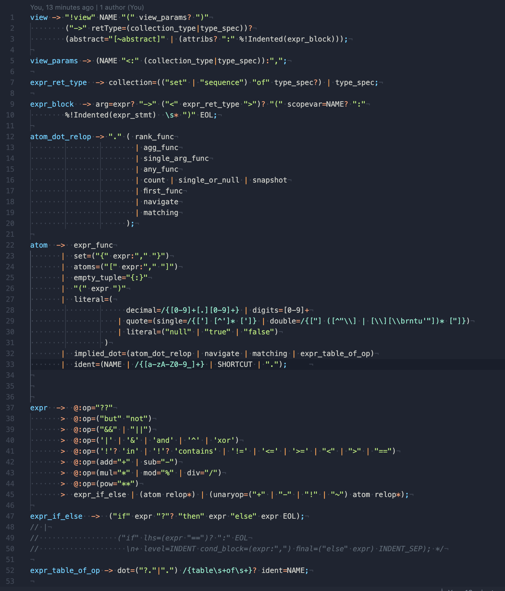

# wbnf Syntax Highlighter

This adds language support for the [ωBNF language](https://github.com/arr-ai/wbnf)

## Features

Syntax highlighting for ωBNF.

## Development

For details on development, refer to [this](./vsc-extension-quickstart.md)
